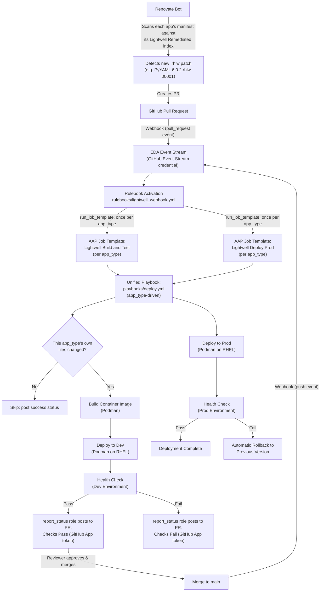

# Lightwell + Ansible Patch Pipeline Demo

A hands-on demo of a fully automated dependency patch pipeline, built to
support multiple application languages side by side:

**Red Hat & IBM [Lightwell Network](https://www.redhat.com/en/lightwell)**
supplies remediated (`.rhlw`-patched) packages, **Renovate** watches for
and proposes those patches as pull requests, and **Ansible Automation
Platform (AAP)** builds, tests, promotes, and -- if something goes wrong --
rolls back each application. GitHub events are routed through a single
**Event-Driven Ansible (EDA) Event Stream** rather than per-job-template
webhooks, and status is reported back to GitHub using a token minted from
a GitHub App installation instead of a static personal access token.

## Why this exists

Enterprises running long-lived, pinned versions of open source libraries
need a way to consume security patches without waiting on (or being
forced into) a disruptive major-version upgrade. Lightwell Network
delivers exactly that: backported, signed patches for the versions you
already run. This repo demonstrates how to wire that patch feed into a
real, auditable deployment pipeline instead of installing patches by hand
-- and how to do it for more than one application language from the same
pipeline, rather than duplicating the pipeline per language.

## Multiple apps, one pipeline

This repository hosts one demo application per language under `apps/`:

| App type | Directory | Status |
| --- | --- | --- |
| Python (Flask) | [`apps/python/`](apps/python/README.md) | Available |
| Java | `apps/java/` | Coming soon |

An `app_type` variable (`python`, `java`, ...) is the single switch that
selects which app the pipeline builds, deploys, and reports status for.
Every playbook, role, and rulebook rule is written against `app_type`
rather than a hardcoded language, so onboarding a new app is mostly a
matter of adding its `apps/<type>/` directory and a matching
[job template pair](docs/aap-setup.md) -- not touching pipeline code. See
[Adding a new app type](#adding-a-new-app-type) below.

Each app type publishes to its own Quay registry, named by convention
`lightwell-<type>-demo` (e.g. `quay.io/lightwell-python-demo`,
`quay.io/lightwell-java-demo`).

## Architecture



## Repository layout

```
ansible-lightwell/
├── apps/                   # One directory per app_type; each is self-contained
│   ├── python/             # Demo Flask application (PyYAML + Jinja2) -- see apps/python/README.md
│   │   ├── app.py
│   │   ├── requirements.txt    # Uses the Lightwell Remediated index as primary
│   │   ├── templates/          # Jinja2 dashboard templates
│   │   ├── config/             # YAML config loaded by PyYAML
│   │   ├── static/              # Lightwell-themed CSS
│   │   ├── tests/               # pytest suite
│   │   └── Containerfile
│   └── java/               # Coming soon -- same shape: its own Containerfile, deps, tests
├── playbooks/
│   ├── deploy.yml          # Unified build & deploy for any app_type (build on dev, rollback on prod)
│   └── rollback.yml        # Standalone/manual rollback for any app_type
├── collections/
│   ├── requirements.yml    # Third-party collections (containers.podman, ansible.eda, etc.)
│   └── ansible_collections/demo/lightwell/   # Our own demo.lightwell collection
│       ├── galaxy.yml
│       └── roles/
│           ├── build_app/     # Build & push the container image via Podman (app_type-driven auth)
│           ├── deploy_app/    # Deploy the container via a Podman Quadlet unit
│           ├── health_check/  # Poll /healthz with retries
│           ├── rollback/      # Restore the previous image
│           └── report_status/ # Post commit status back to GitHub via a GitHub App token
├── rulebooks/
│   ├── README.md            # How the rulebook routes GitHub events
│   └── lightwell_webhook.yml   # Routes PR/push events to per-app_type job templates
├── inventory/               # Single "rhlw" host group and vars, including the app_type port map
├── renovate.json            # Renovate config, scoped per app_type by matchFileNames
├── docs/aap-setup.md        # Full AAP configuration walkthrough
└── .pre-commit-config.yaml, .ansible-lint, .yamllint.yml, .gitleaks.toml, ruff.toml
```

## The demo applications

Each `apps/<type>/` directory is a self-contained application with its own
README, dependency manifest, container build, and tests. See:

- [`apps/python/README.md`](apps/python/README.md) -- a Flask dashboard
  that uses PyYAML and Jinja2 in a way that's visible in the UI, not just
  in `requirements.txt`. Any dependency version carrying the Lightwell
  `.rhlw-0000X` suffix is called out with a "Lightwell Patched" badge, so
  a Renovate-driven version bump becomes visually obvious.
- `apps/java/README.md` -- coming soon.

## Path-based filtering: only deploy when an app's own files change

Not every commit or PR needs a build, and a PR touching only
`apps/python/` shouldn't trigger a Java build (or vice versa). A change to
`README.md` or `renovate.json` shouldn't burn CI minutes building and
deploying any application. Both the push (prod) and pull-request (dev)
code paths are filtered the same way, entirely inside
[`playbooks/deploy.yml`](playbooks/deploy.yml), using the `app_type` extra
var each job template is launched with:

### Push events (production deploys)

The first `pre_task` block in the deploy play calls the GitHub
[Commits API](https://docs.github.com/en/rest/commits/commits#get-a-commit)
for `app_git_sha` (the pushed commit) to get its list of changed files, and
ends the play early -- posting a "Skipped" success status back to the
commit -- when nothing under `apps/{{ app_type }}/` was modified.

### Pull-request events (dev builds)

GitHub `pull_request` webhook payloads don't include a list of changed
files (only an integer count), so this can't be checked from the event
payload alone. The first task block in the build play calls the GitHub
[Pull Request Files API](https://docs.github.com/en/rest/pulls/pulls#list-pull-requests-files)
to get the changed file list, and ends the play early (posting a "Skipped"
success status back to the PR) when nothing under `apps/{{ app_type }}/`
was modified.

### Why filtering lives in the playbook, not the EDA rulebook

An earlier version filtered push events at the EDA layer with a custom
`demo.lightwell.path_filter` event filter plugin, so unwanted pushes never
launched an AAP job at all. That plugin lived in this project's own
collection -- but Decision Environments don't mount local collections, so
it was never actually available to the Rulebook Activation in a real AAP
deployment, only in local `ansible-rulebook` testing. It's been removed,
and [`rulebooks/lightwell_webhook.yml`](rulebooks/lightwell_webhook.yml)
no longer filters by path at all; every matching `pull_request`/`push`
event launches one job template per app type, and that job template's
playbook decides whether to actually build/deploy for its own `app_type`.

### Alternatives considered

| Approach | Pros | Cons |
| --- | --- | --- |
| **EDA event filter plugin** (previous push approach) | Cheapest: no AAP job is launched at all. | Requires a custom collection plugin, which Decision Environments don't mount in practice; doesn't work for PR events either, since the payload lacks file paths. |
| **GitHub Actions `paths:` filter → `repository_dispatch`** | GitHub-native path filtering; bullet-proof. | Adds a second trigger layer and couples the pipeline to Actions. |
| **Early `meta: end_play` in the playbook** (current approach, both cases) | Works regardless of payload content; needs no plugin support from the Decision Environment; can post an explanatory status back to GitHub. | A job is still launched per app type (albeit short-lived); the GitHub API call adds ~1 s. |

The chosen approach trades a small amount of AAP job overhead (one short
job per app type, per event) for a filtering mechanism that only depends
on the playbook's own GitHub API calls -- no reliance on plugins the
Decision Environment may not have.

## The patch pipeline, end to end

1. **Renovate** (configured in [`renovate.json`](renovate.json)) scans
   each app's dependency manifest (e.g. `apps/python/requirements.txt`)
   against its Lightwell Remediated repository, scoped per app type via
   `matchFileNames`. When a new `.rhlw` patch is published, it opens a
   pull request bumping the pinned version.
2. The PR's `pull_request` webhook lands on a single **EDA Event Stream**,
   which forwards it to the `Lightwell Patch Pipeline Router` rulebook
   activation ([`rulebooks/lightwell_webhook.yml`](rulebooks/lightwell_webhook.yml)).
   The rulebook matches the `opened`/`synchronize`/`reopened` condition and
   launches **Lightwell `<Type>` // Build & Test** for every app type,
   each with `app_type` set as an extra var. Every launch runs
   [`playbooks/deploy.yml`](playbooks/deploy.yml) with `app_environment: dev`:
   check whether that app type's files actually changed (see
   [Path-based filtering](#path-based-filtering-only-deploy-when-an-apps-own-files-change)
   above), and if so, build the image from the PR branch, deploy it to
   `dev` via a Podman Quadlet unit, and run a strict health check against
   `/healthz`.
3. The playbook's `demo.lightwell.report_status` role posts the result
   back to the PR as a GitHub commit status (context
   `ci/lightwell-<type>-dev`), authenticating with a token minted on
   demand from a GitHub App installation (via the
   `GitHub App Installation Access Token Lookup` credential) -- no static
   PAT is stored in AAP.
4. Branch protection on `main` requires the relevant check(s) to pass and
   requires at least one approving review before the PR can merge.
5. Merging to `main` sends a `push` webhook to the same Event Stream; the
   rulebook matches the `refs/heads/main` condition and launches
   **Lightwell `<Type>` // Deploy Prod** for every app type, which runs
   [`playbooks/deploy.yml`](playbooks/deploy.yml) with `app_environment: prod`:
   deploy the same tested image to `prod` and health-check it again.
6. If the prod health check fails, the playbook automatically invokes the
   `demo.lightwell.rollback` role, which restores the previously running
   image for that app type and re-verifies health -- no manual
   intervention required for the common case. Either way,
   `demo.lightwell.report_status` posts the final result back to the
   commit.

Full AAP resource setup (credentials, project, inventory, job templates
per app type, the GitHub App, Event Stream, and rulebook activation) is
documented step by step in [`docs/aap-setup.md`](docs/aap-setup.md).

## Lightwell Network configuration

Each `apps/<type>/` manifest sets the Lightwell Remediated repository for
its ecosystem as the primary index, with the public registry as a
fallback for any package it doesn't mirror. For Python
(`apps/python/requirements.txt`):

```
--index-url https://packages.redhat.com/lightwell/python/remediated/simple
--extra-index-url https://pypi.org/simple
```

Authentication uses a Lightwell Network service account (format
`<account-id>|<service-account-name>` plus a token). **These credentials
are never committed to this repository.** They are injected at build time
as a build-context credential file -- format depends on `app_type` (a
`.netrc` for Python's pip install; a Maven `settings.xml` planned for
Java) via `demo.lightwell.build_app`'s `auth_{{ app_type }}.yml` task --
and supplied to Renovate and AAP as secrets/credentials -- see
[`renovate.json`](renovate.json)'s `hostRules` and
[`docs/aap-setup.md`](docs/aap-setup.md#lightwell-network-service-account-custom-credential-type).

### Where the Lightwell service account credentials must live

The same username/token pair is needed in exactly three places, and
nowhere else:

| Location | Purpose | Never do this |
| --- | --- | --- |
| **AAP credential** of type `Lightwell Network` (custom credential type, [`docs/aap-setup.md`](docs/aap-setup.md#lightwell-network-service-account-custom-credential-type)) | Injected into the `build_app` role run as `lightwell_username` / `lightwell_password` extra vars, written to a short-lived credential file used only for the container build, then deleted. | Do not put these values in `group_vars`, role `defaults/`, or any extra-vars file checked into git. |
| **GitHub repository secrets** `LIGHTWELL_USERNAME` and `LIGHTWELL_TOKEN` | Referenced by [`renovate.json`](renovate.json)'s `hostRules` (`{{ secrets.LIGHTWELL_USERNAME }}` / `{{ secrets.LIGHTWELL_TOKEN }}`) so Renovate can query the Lightwell Remediated index for new patches, for every app type. | Do not paste the raw values into `renovate.json` or any onboarding config committed to the repo. |
| **Local developer machine**, credential file only if resolving Lightwell-remediated packages locally (outside of a container build) | Lets your local package manager resolve `.rhlw` packages directly for local testing. | Do not commit your local credential file, and never copy it into the repo working directory (`.gitignore` already excludes any stray `.netrc`). |

`.gitleaks.toml` includes custom rules that specifically detect the
Lightwell username format (`<id>|<name>`), Lightwell JWT tokens, and
`.netrc` credential blocks, so an accidental commit of any of the above is
caught by the pre-commit hook before it ever reaches git history.

## Setting up Renovate

The steps below are what's needed to bring Renovate up on a fresh copy of
this repo (e.g. after forking it into your own GitHub org).

### 1. Install the Renovate GitHub App

Renovate's hosted [GitHub App](https://github.com/apps/renovate) is free
for public and private repositories, with no usage limits.

- Go to [github.com/apps/renovate](https://github.com/apps/renovate) and
  click **Install**.
- Pick the account/org that owns the repo, then select **Only select
  repositories** and choose this one (or **All repositories** if you want
  it everywhere).
- No plan selection or payment step -- installing grants access
  immediately.

Renovate then reads the [`renovate.json`](renovate.json) already
committed at the repo root and starts scanning on its own schedule; no
onboarding PR is needed since the config file already exists.

### 2. Configure `renovate.json`

The committed [`renovate.json`](renovate.json) is ready to use as-is, and
is designed to scale to multiple app types in one repo without cross-app
noise:

- `enabledManagers` -- lists one manager per app type's ecosystem (e.g.
  `pip_requirements` for Python, `maven` for Java), rather than scanning
  every possible ecosystem.
- `additionalBranchPrefix: "{{parentDir}}-"` -- splits Renovate branches
  and PRs by the package manifest's parent directory, so each app type
  gets independent PRs.
- `packageRules` -- each manager is disabled by default, then re-enabled
  only for packages Lightwell actually remediates, scoped to that app's
  directory via `matchFileNames` (e.g. `apps/python/**`). See
  [`renovate-package-scoping.mdc`](.cursor/rules/renovate-package-scoping.mdc)
  for the exact pattern to follow when adding a new app type.
- `hostRules` -- authenticates against `packages.redhat.com` using
  `{{ secrets.LIGHTWELL_USERNAME }}` / `{{ secrets.LIGHTWELL_TOKEN }}`
  (see step 3), shared across all app types since they use the same
  Lightwell Network service account.
- `vulnerabilityAlerts.enabled: true` -- runs immediately on CVE
  detection, bypassing the `schedule` below.

### 3. Add the Lightwell credentials

`hostRules` references two secrets that must be defined in the
**Mend Developer Portal**, not as GitHub repository secrets (the hosted
Renovate app can't read GitHub Actions secrets):

- Go to [developer.mend.io](https://developer.mend.io/), find this
  repository, and add `LIGHTWELL_USERNAME` and `LIGHTWELL_TOKEN` as
  encrypted secrets there.
- See [Where the Lightwell service account credentials must
  live](#where-the-lightwell-service-account-credentials-must-live)
  above for what these values are and where else they're used.

### 4. Scan schedule

`renovate.json` sets:

```json
"timezone": "America/Chicago",
"schedule": ["before 7am every day"]
```

This limits scans (and new/updated PRs) to a daily window before 7 AM
Central. `vulnerabilityAlerts` ignores this window and fires as soon as a
CVE is published. To change the cadence, edit the `schedule` array using
[later.js syntax](https://breejs.github.io/later/), e.g.:

- `"before 7am on Monday"` -- weekly
- `"every weekday"` -- Monday-Friday, any time
- Remove the `schedule` key entirely -- scan at any time

### 5. Trigger a scan manually

Two ways to force a scan without waiting for the schedule:

- **Dependency Dashboard issue** (recommended): after the first scan,
  Renovate opens a "Dependency Dashboard" issue in the repo. Check the
  "Click on this checkbox to trigger a scan" box in that issue and save;
  Renovate picks up the change within a few minutes.
- **Rebase an existing PR**: on any open Renovate PR, tick the "rebase"
  checkbox in the PR description to force Renovate to re-evaluate that
  one dependency immediately.

### What happens next

Once Renovate opens a PR bumping a Lightwell-remediated package for any
app type, it flows through the same pipeline described in [The patch
pipeline, end to end](#the-patch-pipeline-end-to-end) above -- EDA routes
the webhook to AAP, which builds, tests, and reports status back to the
PR for that app.

## Adding a new app type

Because every playbook, role, and rulebook rule keys off `app_type`
rather than a hardcoded language, adding a new app type is mostly
additive:

1. Add `apps/<type>/` with its own Containerfile, dependency manifest,
   config, and tests -- self-contained, following the shape of
   `apps/python/`.
2. Add an `app_type: <type>` entry to `app_port_map` in
   [`inventory/group_vars/all.yml`](inventory/group_vars/all.yml) (two
   free host ports, one per environment).
3. If the new ecosystem needs different build-time authentication than
   a `.netrc`, add `roles/build_app/tasks/auth_<type>.yml` (see
   `auth_python.yml` for the pattern); `build_app` dispatches to it
   automatically based on `app_type`.
4. Add a `matchManagers`/`matchFileNames`-scoped `packageRules` entry to
   [`renovate.json`](renovate.json) for the new ecosystem (see
   [`renovate-package-scoping.mdc`](.cursor/rules/renovate-package-scoping.mdc)).
5. Add the two matching rules to
   [`rulebooks/lightwell_webhook.yml`](rulebooks/lightwell_webhook.yml)
   for each event (PR build & test, demo reset, deploy prod), copying the
   existing Python/Java rule pairs and setting `app_type` and the job
   template name for the new type.
6. In AAP, create the new app type's job template pair (`Lightwell
   <Type> // Build & Test`, `Lightwell <Type> // Deploy Prod`) and a Quay
   registry named `lightwell-<type>-demo`, per
   [`docs/aap-setup.md`](docs/aap-setup.md).

No changes are needed to `playbooks/deploy.yml`, `playbooks/rollback.yml`,
or any of the `demo.lightwell` collection roles -- they are already
app-type agnostic.

## Code quality: linting and pre-commit hooks

This repo uses [pre-commit](https://pre-commit.com/) to enforce the same
checks locally that a real enterprise pipeline would run in CI:

| Tool | Purpose |
| --- | --- |
| [gitleaks](https://github.com/gitleaks/gitleaks) | Secret scanning, including custom rules for Lightwell service account tokens and `.netrc` blocks ([`.gitleaks.toml`](.gitleaks.toml)) |
| [ansible-lint](https://ansible.readthedocs.io/projects/lint/) | Enforces the `production` rule profile across all playbooks and roles ([`.ansible-lint`](.ansible-lint)) |
| [yamllint](https://yamllint.readthedocs.io/) | YAML style consistency ([`.yamllint.yml`](.yamllint.yml)) |
| [ruff](https://docs.astral.sh/ruff/) | Python linting + formatting for `apps/python/` ([`ruff.toml`](ruff.toml)) |

Set up once per clone:

```bash
pip install pre-commit
pre-commit install
```

Run against the whole repo at any time:

```bash
pre-commit run --all-files
```

## Prerequisites for a full live run

- A GitHub repository with webhooks enabled and branch protection
  configured on `main`.
- A GitHub App installed on the repository (commit-status write access)
  for AAP to authenticate as when posting status checks -- see
  [`docs/aap-setup.md`](docs/aap-setup.md#github-app-and-status-reporting-credentials).
- An AAP instance (2.5+) with Event-Driven Ansible enabled and reachable
  from GitHub -- see [`docs/aap-setup.md`](docs/aap-setup.md).
- A single Podman-capable RHEL host (inventory group `rhlw`) that AAP
  both builds every app's image on and deploys `dev`/`prod` to. Each app
  type/environment combination runs as a separate container on its own
  port on that one host (see `app_port_map` in
  [`inventory/group_vars/all.yml`](inventory/group_vars/all.yml)) so they
  don't collide.
- One container registry per app type that both AAP and the target hosts
  can reach, named by convention `lightwell-<type>-demo` (default:
  `quay.io/lightwell-python-demo`, `quay.io/lightwell-java-demo`).
- A Lightwell Network service account.
