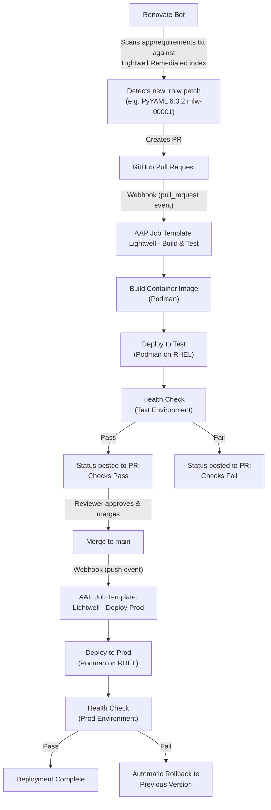

# Lightwell + Ansible Patch Pipeline Demo

A hands-on demo of a fully automated Python dependency patch pipeline:

**Red Hat & IBM [Lightwell Network](https://www.redhat.com/en/lightwell)**
supplies remediated (`.rhlw`-patched) Python packages, **Renovate** watches
for and proposes those patches as pull requests, and **Ansible Automation
Platform (AAP)** builds, tests, promotes, and -- if something goes wrong --
rolls back the application, all triggered by GitHub webhooks.

## Why this exists

Enterprises running long-lived, pinned versions of open source libraries
need a way to consume security patches without waiting on (or being
forced into) a disruptive major-version upgrade. Lightwell Network
delivers exactly that: backported, signed patches for the versions you
already run. This repo demonstrates how to wire that patch feed into a
real, auditable deployment pipeline instead of installing patches by hand.

## Architecture



## Repository layout

```
ansible-lightwell/
├── app/                    # Demo Flask application (PyYAML + Jinja2)
│   ├── app.py
│   ├── requirements.txt    # Points at the Lightwell Remediated index
│   ├── templates/          # Jinja2 dashboard templates
│   ├── config/             # YAML config loaded by PyYAML
│   ├── static/             # Lightwell-themed CSS
│   ├── tests/              # pytest suite
│   └── Containerfile
├── playbooks/
│   ├── deploy_test.yml     # Build + deploy to test (PR webhook)
│   ├── deploy_prod.yml     # Deploy to prod + health check + rollback (push webhook)
│   └── rollback.yml        # Standalone/manual rollback
├── collections/
│   ├── requirements.yml    # Third-party collections (containers.podman, etc.)
│   └── ansible_collections/demo/lightwell/   # Our own demo.lightwell collection
│       ├── galaxy.yml
│       └── roles/
│           ├── build_app/    # Build & push the container image via Podman
│           ├── deploy_app/   # Deploy the container via Podman + systemd
│           ├── health_check/ # Poll /healthz with retries
│           └── rollback/     # Restore the previous image
├── inventory/               # test/prod host groups and vars
├── renovate.json           # Renovate config targeting the Lightwell index
├── docs/aap-setup.md       # Full AAP configuration walkthrough
└── .pre-commit-config.yaml, .ansible-lint, .yamllint.yml, .gitleaks.toml, ruff.toml
```

## The demo application

A small Flask dashboard that uses both target libraries in a way that's
visible in the UI, not just in `requirements.txt`:

- **PyYAML** loads `app/config/app_config.yaml` -- service metadata,
  feature flags, and a patch timeline -- at startup.
- **Jinja2** (via Flask) renders the dashboard itself, including a live
  table of installed dependency versions. Any version carrying the
  Lightwell `.rhlw-0000X` suffix is called out with a "Lightwell Patched"
  badge, so a Renovate-driven version bump becomes visually obvious.

Run it locally:

```bash
cd app
python3 -m venv .venv && source .venv/bin/activate
pip install -r requirements-dev.txt
python app.py
# visit http://localhost:8080
```

Run the tests:

```bash
cd app
pytest
```

## The patch pipeline, end to end

1. **Renovate** (configured in [`renovate.json`](renovate.json)) scans
   `app/requirements.txt` against the Lightwell Remediated repository
   (`packages.redhat.com/lightwell/python/remediated/simple`) as well as
   PyPI. When a new `.rhlw` patch is published for PyYAML or Jinja2, it
   opens a pull request bumping the pinned version.
2. The PR's `pull_request` webhook fires against AAP's
   **Lightwell - Build & Test** job template, which runs
   [`playbooks/deploy_test.yml`](playbooks/deploy_test.yml): build the
   image from the PR branch, deploy it to `test` via Podman, and run a
   strict health check against `/healthz`.
3. AAP posts the result back to the PR as a GitHub status check.
4. Branch protection on `main` requires that check to pass and requires at
   least one approving review before the PR can merge.
5. Merging to `main` fires a `push` webhook against AAP's
   **Lightwell - Deploy Prod** job template, which runs
   [`playbooks/deploy_prod.yml`](playbooks/deploy_prod.yml): deploy the
   same tested image to `prod` and health-check it again.
6. If the prod health check fails, the playbook automatically invokes the
   `demo.lightwell.rollback` role, which restores the previously running image and
   re-verifies health -- no manual intervention required for the common
   case.

Full AAP resource setup (credentials, project, inventory, job templates,
webhooks, branch protection) is documented step by step in
[`docs/aap-setup.md`](docs/aap-setup.md).

## Lightwell Network configuration

`app/requirements.txt` adds the Lightwell Remediated repository as an
extra index:

```
--extra-index-url https://packages.redhat.com/lightwell/python/remediated/simple
```

Authentication uses a Lightwell Network service account (format
`<account-id>|<service-account-name>` plus a token). **These credentials
are never committed to this repository.** They are injected at build time
as a Podman build secret (see [`app/Containerfile`](app/Containerfile) and
[`demo.lightwell.build_app`](collections/ansible_collections/demo/lightwell/roles/build_app))
and supplied to Renovate and AAP as secrets/credentials -- see
[`renovate.json`](renovate.json)'s `hostRules` and
[`docs/aap-setup.md`](docs/aap-setup.md) section 1a.

### Where the Lightwell service account credentials must live

The same username/token pair is needed in exactly three places, and
nowhere else:

| Location | Purpose | Never do this |
| --- | --- | --- |
| **AAP credential** of type `Lightwell Network` (custom credential type, [`docs/aap-setup.md`](docs/aap-setup.md) section 1a) | Injected into the `build_app` role run as `lightwell_username` / `lightwell_password` extra vars, written to a short-lived `.netrc` used only for the Podman build, then deleted. | Do not put these values in `group_vars`, role `defaults/`, or any extra-vars file checked into git. |
| **GitHub repository secrets** `LIGHTWELL_USERNAME` and `LIGHTWELL_TOKEN` | Referenced by [`renovate.json`](renovate.json)'s `hostRules` (`{{ secrets.LIGHTWELL_USERNAME }}` / `{{ secrets.LIGHTWELL_TOKEN }}`) so Renovate can query the Lightwell Remediated index for new patches. | Do not paste the raw values into `renovate.json` or any onboarding config committed to the repo. |
| **Local developer machine**, `~/.netrc`, only if running `pip install` against the Lightwell Remediated index outside of a container build | Lets `pip` on your workstation resolve `.rhlw` packages directly for local testing. | Do not commit your `~/.netrc`, and never copy it into the repo working directory (`.gitignore` already excludes any stray `.netrc`). |

`.gitleaks.toml` includes custom rules that specifically detect the
Lightwell username format (`<id>|<name>`), Lightwell JWT tokens, and
`.netrc` credential blocks, so an accidental commit of any of the above is
caught by the pre-commit hook before it ever reaches git history.

## Code quality: linting and pre-commit hooks

This repo uses [pre-commit](https://pre-commit.com/) to enforce the same
checks locally that a real enterprise pipeline would run in CI:

| Tool | Purpose |
| --- | --- |
| [gitleaks](https://github.com/gitleaks/gitleaks) | Secret scanning, including custom rules for Lightwell service account tokens and `.netrc` blocks ([`.gitleaks.toml`](.gitleaks.toml)) |
| [ansible-lint](https://ansible.readthedocs.io/projects/lint/) | Enforces the `production` rule profile across all playbooks and roles ([`.ansible-lint`](.ansible-lint)) |
| [yamllint](https://yamllint.readthedocs.io/) | YAML style consistency ([`.yamllint.yml`](.yamllint.yml)) |
| [ruff](https://docs.astral.sh/ruff/) | Python linting + formatting for the Flask app ([`ruff.toml`](ruff.toml)) |

Set up once per clone:

```bash
pip install pre-commit
pre-commit install
```

Run against the whole repo at any time:

```bash
pre-commit run --all-files
```

## Prerequisites for a full live run

- A GitHub repository with Actions/webhooks enabled and branch protection
  configured on `main`.
- An AAP (or AWX) instance reachable from GitHub -- see
  [`docs/aap-setup.md`](docs/aap-setup.md).
- Two Podman-capable RHEL hosts (or host groups), one for `test` and one
  for `prod`.
- A container registry both AAP and the target hosts can reach (default:
  `quay.io/lightwell-demo`).
- A Lightwell Network service account.
