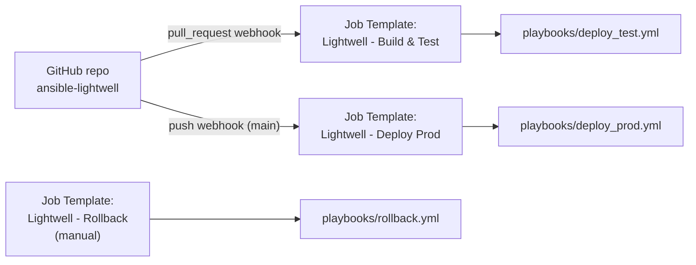

# Ansible Automation Platform Setup Guide

This guide walks through configuring Ansible Automation Platform (AAP) so
that it builds, deploys, health-checks, and (if needed) rolls back the
Lightwell demo application in response to GitHub pull request and push
events.

## Overview



## Prerequisites

- An AAP (or AWX) instance reachable from GitHub, with a valid TLS
  certificate on its webhook endpoint.
- Two Podman-capable RHEL hosts (or host groups) reachable over SSH: one
  for `test`, one for `prod`.
- A container registry the AAP execution environment can push to and the
  target hosts can pull from (default in this repo: `quay.io/lightwell-demo`).
- A Lightwell Network service account (username in the form
  `<account-id>|<service-account-name>`, plus a token). **Never** commit
  these values to the repository -- store them only as an AAP credential.
- A GitHub personal access token (PAT) with `repo` scope, used so AAP can
  post job status back to pull requests.

## 1. Credentials

Create the following credentials under **Automation Execution -> Infrastructure -> Credentials**:

### 1a. Lightwell Network Service Account (custom credential type)

AAP has no built-in credential type for Lightwell, so define one:

**Automation Execution -> Infrastructure -> Credential Types -> Add**

- Name: `Lightwell Network`
- Input configuration:

  ```yaml
  fields:
    - id: lightwell_username
      type: string
      label: Lightwell Username
    - id: lightwell_password
      type: string
      label: Lightwell Token
      secret: true
  required:
    - lightwell_username
    - lightwell_password
  ```

- Injector configuration:

  ```yaml
  extra_vars:
    lightwell_username: "{{ lightwell_username }}"
    lightwell_password: "{{ lightwell_password }}"
  ```

Then create a credential of this new type named `Lightwell Demo Service Account`
and paste in the service account username and token you were issued.

### 1b. GitHub Webhook Credential

- Type: **GitHub Personal Access Token**
- Used on both job templates below so AAP can report job status
  (pending/success/error) back onto the pull request / commit.

### 1c. Machine Credential

- Type: **Machine**
- SSH credentials (or SSH key) AAP uses to reach the `test` and `prod`
  Podman hosts.

### 1d. Container Registry Credential (optional)

- Type: **Container Registry**
- Only needed if `quay.io/lightwell-demo` (or your chosen registry) requires
  authentication for pulls on the target hosts. Exposed to the `demo.lightwell.deploy_app`
  role as `registry_username` / `registry_password`.

## 2. Project

**Automation Execution -> Infrastructure -> Projects -> Add**

- Name: `ansible-lightwell`
- Source Control Type: `Git`
- Source Control URL: `git@github.com:zjleblanc/ansible-lightwell.git`
- Source Control Branch/Tag/Commit: leave blank so job templates can
  override the checkout ref per-run (needed for pull-request builds).
- Update Revision on Launch: enabled

## 3. Inventory

**Automation Execution -> Infrastructure -> Inventories -> Add**

- Name: `lightwell-demo`
- Add a `test` group and a `prod` group, each containing the relevant
  Podman host(s) -- mirror `inventory/hosts.yml` in this repo, or import it
  directly as a source-controlled inventory pointed at the same project.
- Attach the Machine credential from step 1c.

## 4. Job Templates

### 4a. Lightwell - Build & Test

| Field | Value |
| --- | --- |
| Inventory | `lightwell-demo` |
| Project | `ansible-lightwell` |
| Playbook | `playbooks/deploy_test.yml` |
| Credentials | Lightwell Demo Service Account, Machine |
| Limit | `test` |
| Source Control Branch/Tag/Commit override | Prompt on launch (so PR builds check out the PR head SHA) |
| Extra Variables | Prompt on launch |

Enable the webhook:

1. Check **Enable Webhook**.
2. Webhook Service: `GitHub`.
3. Webhook Credential: the GitHub PAT credential from step 1b (so AAP can
   post check status back to the PR).
4. Save, then copy the generated **Webhook URL** and **Webhook Key**.

### 4b. Lightwell - Deploy Prod

| Field | Value |
| --- | --- |
| Inventory | `lightwell-demo` |
| Project | `ansible-lightwell` |
| Playbook | `playbooks/deploy_prod.yml` |
| Credentials | Machine, Container Registry (if used) |
| Limit | `prod` |
| Extra Variables | Prompt on launch (needs `app_image_tag`, typically the merge commit SHA that was already validated in test) |

Enable the webhook the same way, but scope it to `push` events on `main`
(configured on the GitHub side in step 6).

### 4c. Lightwell - Rollback (manual)

| Field | Value |
| --- | --- |
| Inventory | `lightwell-demo` |
| Project | `ansible-lightwell` |
| Playbook | `playbooks/rollback.yml` |
| Credentials | Machine |
| Extra Variables | `target_environment` prompted on launch (`test` or `prod`) |

No webhook needed -- this template is for on-demand manual rollback.

## 5. Workflow Job Template (optional)

For a single visual pipeline, create a **Workflow Job Template** named
`Lightwell Patch Pipeline` that chains:

1. `Lightwell - Build & Test` (webhook node, `pull_request` events)
2. On success -> (external) update PR status / notify reviewers
3. On failure -> (external) notify PR author, leave PR open

And a second workflow, `Lightwell Prod Rollout`, chaining:

1. `Lightwell - Deploy Prod` (webhook node, `push` events on `main`)
2. On failure -> `Lightwell - Rollback` (automatic node)

Note that `playbooks/deploy_prod.yml` already performs the rollback inline
on health check failure, so the extra workflow node is optional and mainly
useful if you want the rollback to show as a distinct, auditable step in
the AAP workflow visualizer.

## 6. GitHub Webhook Configuration

In the GitHub repository: **Settings -> Webhooks -> Add webhook**

For the **Build & Test** webhook (from job template 4a):

- Payload URL: the Webhook URL from AAP
- Content type: `application/json`
- Secret: the Webhook Key from AAP
- Events: select **Pull requests** individually (required for AAP to post
  status back)

For the **Deploy Prod** webhook (from job template 4b):

- Payload URL: the Webhook URL from AAP
- Content type: `application/json`
- Secret: the Webhook Key from AAP
- Events: select **Pushes**, and restrict to the `main` branch either via a
  branch filter in your workflow logic or by checking
  `awx_webhook_payload.ref == 'refs/heads/main'` at the top of
  `deploy_prod.yml` if you route all pushes through one webhook.

The webhook payload is available in the playbook as the `awx_webhook_payload`
extra variable, e.g. `awx_webhook_payload.pull_request.head.sha` for the PR
head commit, or `awx_webhook_payload.after` for the post-merge commit SHA on
`main`.

## 7. Branch Protection on GitHub

**Settings -> Branches -> Add rule** for `main`:

- Require a pull request before merging
- Require approvals (at least 1)
- Require status checks to pass before merging (the check posted by the
  `Lightwell - Build & Test` job template)

This is what enforces the "successful test leads to a PR to main with
approval requirements" step of the pipeline.

## 8. End-to-End Flow

1. Renovate scans `app/requirements.txt` against the Lightwell Remediated
   index and opens a PR bumping `PyYAML` or `Jinja2` to a `.rhlw-0000X`
   version.
2. GitHub's `pull_request` webhook fires -> AAP runs
   `Lightwell - Build & Test`, building the image from the PR branch and
   deploying/health-checking it in `test`.
3. AAP posts the job result back to the PR as a status check.
4. A reviewer approves and merges the PR into `main` (blocked until the
   check passes, per step 7).
5. GitHub's `push` webhook fires -> AAP runs `Lightwell - Deploy Prod`,
   deploying the same image to `prod` and health-checking it.
6. If the prod health check fails, `playbooks/deploy_prod.yml`
   automatically rolls back to the previously running image and re-checks
   health before failing the job (which surfaces as a failed AAP job for
   alerting/notification).
