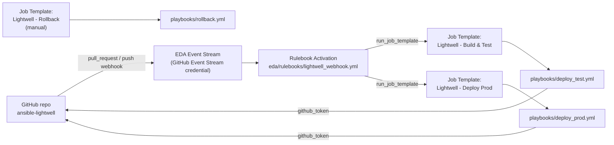

# Ansible Automation Platform Setup Guide

This guide walks through configuring Ansible Automation Platform (AAP) so
that it builds, deploys, health-checks, and (if needed) rolls back the
Lightwell demo application in response to GitHub pull request and push
events.

GitHub does not talk to job templates directly. Instead, all GitHub events
land on a single **Event-Driven Ansible (EDA) Event Stream**, which
forwards them to a **Rulebook Activation** that decides which job template
to launch and with which extra vars. Status is reported back to GitHub
using a token minted on demand from a **GitHub App** installation, via the
`GitHub App Installation Access Token Lookup` credential -- no static
GitHub PAT is stored anywhere in this pipeline.

## Overview



## Prerequisites

- An AAP instance (2.5+) with Event-Driven Ansible enabled, reachable from
  GitHub with a valid TLS certificate on its Event Stream endpoint.
- Two Podman-capable RHEL hosts (or host groups) reachable over SSH: one
  for `test`, one for `prod`.
- A container registry the AAP execution environment can push to and the
  target hosts can pull from (default in this repo: `quay.io/lightwell-demo`).
- A Lightwell Network service account (username in the form
  `<account-id>|<service-account-name>`, plus a token). **Never** commit
  these values to the repository -- store them only as an AAP credential.
- A **GitHub App** installed on this repository (see step 1b) -- used
  instead of a personal access token so status-reporting credentials are
  short-lived and scoped to the app's own permissions.

## 1. Credentials

Create the following credentials under **Automation Execution -> Infrastructure -> Credentials**:

### 1a. Lightwell Network Service Account (custom credential type)

AAP has no built-in credential type for Lightwell, so define one:

**Automation Execution -> Infrastructure -> Credential Types -> Add**

- Name: `Lightwell Network`
- Input configuration:

  ```yaml
  fields:
    - id: lightwell_username
      type: string
      label: Lightwell Username
    - id: lightwell_password
      type: string
      label: Lightwell Token
      secret: true
  required:
    - lightwell_username
    - lightwell_password
  ```

- Injector configuration:

  ```yaml
  extra_vars:
    lightwell_username: "{{ lightwell_username }}"
    lightwell_password: "{{ lightwell_password }}"
  ```

Then create a credential of this new type named `Lightwell Demo Service Account`
and paste in the service account username and token you were issued.

### 1b. GitHub App and status-reporting credentials

Instead of a static GitHub PAT, this pipeline authenticates to GitHub as a
**GitHub App**, minting a short-lived installation access token on demand.

1. **Create the GitHub App** (GitHub org/user -> Settings -> Developer
   settings -> GitHub Apps -> New GitHub App):
   - Webhook: leave disabled here -- the Event Stream in step 6 receives
     webhooks independently of the App itself.
   - Repository permissions: **Commit statuses: Read and write**,
     **Contents: Read-only**, **Metadata: Read-only**.
   - Generate a private key (downloads a `.pem` file) and note the **App
     ID**.
   - Install the App on the `ansible-lightwell` repository and note the
     **Installation ID** (visible in the installation's settings URL).

2. **Create the lookup credential** (Automation Execution -> Infrastructure
   -> Credentials -> Add):
   - Credential type: `GitHub App Installation Access Token Lookup`
   - GitHub App ID: the App ID from step 1
   - GitHub App Installation ID: the Installation ID from step 1
   - RSA Private Key: contents of the `.pem` file
   - Name it `Lightwell GitHub App Lookup`.

3. **Create a custom credential type** to carry the resolved token into a
   job as an extra var (Automation Execution -> Infrastructure ->
   Credential Types -> Add):
   - Name: `GitHub Status Token`
   - Input configuration:

     ```yaml
     fields:
       - id: github_token
         type: string
         label: GitHub Token
         secret: true
     required:
       - github_token
     ```

   - Injector configuration:

     ```yaml
     extra_vars:
       github_token: "{{ github_token }}"
     ```

4. **Create the target credential** of the `GitHub Status Token` type
   named `Lightwell GitHub Status Reporter`. On its `GitHub Token` field,
   click the external-credential (key) icon and link it to
   `Lightwell GitHub App Lookup` from step 2, with username
   `x-access-token`. AAP now resolves a fresh installation token from the
   GitHub App every time this credential is used, instead of storing a
   static secret.

   Attach `Lightwell GitHub Status Reporter` to both the
   `Lightwell - Build & Test` and `Lightwell - Deploy Prod` job templates
   (step 4) -- `demo.lightwell.report_status` reads `github_token` from it
   to post commit statuses back to GitHub.

### 1c. Machine Credential

- Type: **Machine**
- SSH credentials (or SSH key) AAP uses to reach the `test` and `prod`
  Podman hosts.

### 1d. Container Registry Credential (optional)

- Type: **Container Registry**
- Only needed if `quay.io/lightwell-demo` (or your chosen registry) requires
  authentication for pulls on the target hosts. Exposed to the
  `demo.lightwell.deploy_app` role as `registry_username` /
  `registry_password`.

### 1e. Controller API Credential (for the Rulebook Activation)

- Type: **Red Hat Ansible Automation Platform**
- A token credential the `run_job_template` action in the rulebook uses to
  call back into Controller and launch job templates. Attach it to the
  Rulebook Activation in step 6, not to the job templates themselves.

## 2. Project

**Automation Execution -> Infrastructure -> Projects -> Add**

- Name: `ansible-lightwell`
- Source Control Type: `Git`
- Source Control URL: `git@github.com:zjleblanc/ansible-lightwell.git`
- Source Control Branch/Tag/Commit: leave blank so job templates can
  override the checkout ref per-run (needed for pull-request builds).
- Update Revision on Launch: enabled

This same project (and checkout) also supplies the rulebook at
`eda/rulebooks/lightwell_webhook.yml` -- create a matching **EDA Project**
under **Automation Decisions -> Projects** pointing at the same
repository URL so the rulebook is available to Rulebook Activations.

## 3. Inventory

**Automation Execution -> Infrastructure -> Inventories -> Add**

- Name: `lightwell-demo`
- Add a `test` group and a `prod` group, each containing the relevant
  Podman host(s) -- mirror `inventory/hosts.yml` in this repo, or import it
  directly as a source-controlled inventory pointed at the same project.
- Attach the Machine credential from step 1c.

## 4. Job Templates

Job templates are no longer launched by GitHub directly -- they're
launched by the Rulebook Activation's `run_job_template` action (step 6),
so **no webhook configuration is needed on the job templates themselves**.

### 4a. Lightwell - Build & Test

| Field | Value |
| --- | --- |
| Inventory | `lightwell-demo` |
| Project | `ansible-lightwell` |
| Playbook | `playbooks/deploy_test.yml` |
| Credentials | Lightwell Demo Service Account, Machine, Lightwell GitHub Status Reporter |
| Limit | `test` |
| Source Control Branch/Tag/Commit override | Prompt on launch (so PR builds check out the PR head SHA) |
| Extra Variables | Prompt on launch (the rulebook supplies `app_git_sha`, `github_repo_full_name`, `github_pr_number`) |

### 4b. Lightwell - Deploy Prod

| Field | Value |
| --- | --- |
| Inventory | `lightwell-demo` |
| Project | `ansible-lightwell` |
| Playbook | `playbooks/deploy_prod.yml` |
| Credentials | Machine, Container Registry (if used), Lightwell GitHub Status Reporter |
| Limit | `prod` |
| Extra Variables | Prompt on launch (the rulebook supplies `app_git_sha`, `github_repo_full_name`) |

### 4c. Lightwell - Rollback (manual)

| Field | Value |
| --- | --- |
| Inventory | `lightwell-demo` |
| Project | `ansible-lightwell` |
| Playbook | `playbooks/rollback.yml` |
| Credentials | Machine |
| Extra Variables | `target_environment` prompted on launch (`test` or `prod`) |

No webhook or Event Stream needed -- this template is for on-demand manual
rollback.

## 5. Decision Environment

**Automation Decisions -> Decision Environments -> Add**

- Name: `lightwell-decision-environment`
- Image: the default EDA decision environment image is sufficient for this
  demo (it already includes `ansible.eda`). Only build a custom one if you
  need additional collections inside the rulebook's own container.

## 6. Event Stream & Rulebook Activation

This replaces per-job-template webhooks with a single, centrally managed
entry point.

### 6a. Event Stream credential

**Automation Decisions -> Infrastructure -> Credentials -> Create credential**

- Credential type: `GitHub Event Stream` (a specialization of the HMAC
  event stream type -- GitHub's signature header defaults are pre-filled)
- HMAC Secret: generate a strong random string and save it -- you will
  reuse it as the webhook secret in step 6d
- Name it `Lightwell GitHub Event Stream Credential`

The GitHub Event Stream credential uses HMAC to verify that every incoming
webhook payload genuinely originated from GitHub and has not been tampered
with in transit. See [Red Hat docs -- Creating an event stream credential][rh-es-cred].

### 6b. Event Stream

**Automation Decisions -> Event Streams -> Create event stream**

- Name: `lightwell-github-events`
- Event stream type: `GitHub`
- Credential: `Lightwell GitHub Event Stream Credential`
- Headers: `X-GitHub-Event, X-GitHub-Delivery` (only the headers your
  rulebook conditions and actions need -- avoid `*` in production)
- Forward events to rulebook activation: **enabled**

After saving, copy the generated **payload URL** -- you will paste it into
the GitHub webhook in step 6d. See [Red Hat docs -- Creating an event stream][rh-es].

> **Tip:** Leave *Forward events to rulebook activation* **disabled**
> initially so you can confirm connectivity and inspect sample payloads on
> the Event Stream's detail page before events reach the rulebook. Toggle
> it on once the webhook is delivering successfully.

### 6c. Rulebook Activation

**Automation Decisions -> Rulebook Activations -> Create rulebook activation**

- Name: `Lightwell Patch Pipeline Router`
- Project: the EDA project from step 2
- Rulebook: `eda/rulebooks/lightwell_webhook.yml`
- Event streams: click the gear icon to open the source-mapping UI and map
  the rulebook's `github_webhook` source to `lightwell-github-events`.
  This replaces the rulebook's `ansible.eda.webhook` source with
  `ansible.eda.pg_listener`, routing events from the Event Stream into the
  rulebook. Only the source type, name, and arguments are swapped --
  filters, rules, conditions, and actions remain unchanged.
- Credentials: the Controller API credential from step 1e (required by
  `run_job_template` to launch job templates)
- Decision environment: `lightwell-decision-environment`
- Restart policy: `On failure`

See [Red Hat docs -- Replacing sources and attaching event streams to activations][rh-es-attach].

### 6d. Configure GitHub webhook

In the GitHub repository: **Settings -> Webhooks -> Add webhook**

- Payload URL: the Event Stream payload URL copied from step 6b
- Content type: `application/json`
- Secret: the same HMAC secret you generated for the `GitHub Event Stream`
  credential in step 6a
- Events: select **Pull requests** and **Pushes** (one webhook covers
  both flows -- the rulebook's conditions decide which job template to
  launch)

After adding the webhook, GitHub sends a test `ping` payload. Verify on
the Event Stream's detail page in AAP that it was received (the *Events
received* counter increments and the header/body are visible). See
[Red Hat docs -- Configuring your remote system to send events][rh-es-remote]
and [Verifying your event streams work][rh-es-verify].

[rh-es-cred]: https://docs.redhat.com/en/documentation/red_hat_ansible_automation_platform/2.5/html/using_automation_decisions/simplified-event-routing#proc-eda-set-up-credential
[rh-es]: https://docs.redhat.com/en/documentation/red_hat_ansible_automation_platform/2.5/html/using_automation_decisions/simplified-event-routing#proc-eda-set-up-new-event-stream
[rh-es-attach]: https://docs.redhat.com/en/documentation/red_hat_ansible_automation_platform/2.5/html/using_automation_decisions/simplified-event-routing#proc-eda-set-up-rulebook-activation
[rh-es-remote]: https://docs.redhat.com/en/documentation/red_hat_ansible_automation_platform/2.5/html/using_automation_decisions/simplified-event-routing#event-stream-configure-remote
[rh-es-verify]: https://docs.redhat.com/en/documentation/red_hat_ansible_automation_platform/2.5/html/using_automation_decisions/simplified-event-routing#event-stream-verify

## 7. Branch Protection on GitHub

**Settings -> Branches -> Add rule** for `main`:

- Require a pull request before merging
- Require approvals (at least 1)
- Require status checks to pass before merging -- select the
  `ci/lightwell-test` context (posted by `demo.lightwell.report_status`
  from `playbooks/deploy_test.yml`, using the token from the
  `Lightwell GitHub Status Reporter` credential)

This is what enforces the "successful test leads to a PR to main with
approval requirements" step of the pipeline.

## 8. End-to-End Flow

1. Renovate scans `app/requirements.txt` against the Lightwell Remediated
   index and opens a PR bumping `PyYAML` or `Jinja2` to a `.rhlw-0000X`
   version.
2. GitHub sends a `pull_request` webhook to the Event Stream, which
   forwards it to the `Lightwell Patch Pipeline Router` rulebook
   activation.
3. The rulebook matches the `opened`/`synchronize`/`reopened` condition
   and launches `Lightwell - Build & Test` with `app_git_sha` and
   `github_repo_full_name` from the payload.
4. `playbooks/deploy_test.yml` marks the `ci/lightwell-test` status
   `pending`, builds the image from the PR branch, deploys/health-checks
   it in `test`, then reports `success` or `failure` back to GitHub using
   the GitHub App installation token.
5. Branch protection blocks merging until `ci/lightwell-test` passes and a
   reviewer approves; a reviewer then merges the PR into `main`.
6. GitHub sends a `push` webhook to the same Event Stream; the rulebook
   matches the `refs/heads/main` condition and launches
   `Lightwell - Deploy Prod` with the merge commit SHA.
7. `playbooks/deploy_prod.yml` deploys the same tested image to `prod`,
   health-checks it, and reports status back to GitHub (context
   `ci/lightwell-prod`) the same way.
8. If the prod health check fails, the playbook automatically rolls back
   to the previously running image, re-checks health, and reports the
   final outcome -- surfacing as a failed AAP job for alerting if the
   rollback itself doesn't come back healthy.
